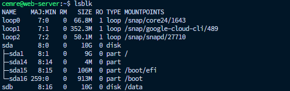
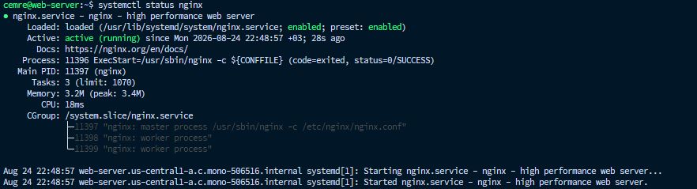
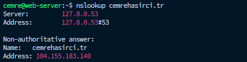
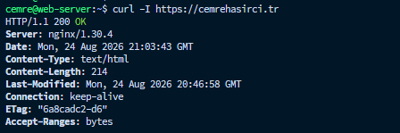

# Google Cloud VM ve Domain Yayına Alma
Bu çalışmada, METUnic üzerinden alınan cemrehasirci.tr domain'i Google Cloud üzerinde oluşturulan Ubuntu 24.04 LTS tabanlı bir VM'e yönlendirilmiş ve Nginx kullanılarak web yayını yapılmıştır.

VM'e SSH key tabanlı erişim sağlanmış, ileride application data için kullanılmak üzere ayrı bir Persistent Disk eklenmiştir. Domain Static External IP adresine yönlendirilmiş ve Let's Encrypt certificate kullanılarak HTTPS erişimi sağlanmıştır.

Genel Mimari:

```
cemrehasirci.tr → METUnic DNS → Google Cloud Static External IP → Ubuntu 24.04 LTS VM → Nginx → HTTPS
```


---


## 1. Domain Kaydı
METUnic üzerinden `cemrehasirci.tr` domain'i satın alındı.


---


## 2. Google Cloud VM Create
Google Cloud Console üzerinden Compute Engine API aktif edildikten sonra yeni bir VM oluşturuldu.


### VM Configuration
| Özellik | Değer |
| --- | --- |
| Name | web-server |
| Region | us-central1 |
| Zone | us-central1-a |
| Machine Series | E2 |
| Machine Type | e2-micro |
| Memory | 1 GB |

NOT: Machine type olarak `f1-micro` belirtilmişti ancak güncel Google Cloud Free Tier kapsamında `e2-micro` kullanılmıştır.


### OS ve Storage:
VM için işletim sistemi olarak Ubuntu 24.04 LTS, boot ve ek disk olarak ise Free Tier sınırlarına uygun 10 GB Standard Persistent Disk seçildi.

- Boot Disk : 10 GB Standard Persistent Disk 
- Additional Disk : 10 GB Standard Persistent Disk 
- Operating System: Ubuntu 24.04 LTS


### Networking:
Web sunucusuna dışarıdan HTTP ve HTTPS erişimi için ilgili firewall rules aktif edildi.


### Security ve SSH Access:
VM'e SSH key tabanlı erişim sağlandı. Verilen public SSH key, VM'in Security → Add manually generated SSH keys bölümüne eklendi.

Ayrıca kendi bağlantım için WSL üzerinde ayrı bir SSH key oluşturuldu ve görüntülenerek VM'e eklendi.

```bash
ssh-keygen -t ed25519 -C "cemre"
cat ~/.ssh/id_ed25519.pub
```

VM kurulduktan sonra WSL üzerinden bağlantı sağlandı:

```bash
ssh -i ~/.ssh/id_ed25519 cemre@104.155.183.140
```


---


## 3. Additional Persistent Disk Configuration

VM oluşturulurken operating system'in bulunduğu Boot Disk'ten bağımsız olarak 10 GB büyüklüğünde bir Standard Persistent Disk eklendi. Eklenen disk sistem üzerinde `/dev/sdb` olarak görüldü.

```bash
sudo mkfs.ext4 /dev/sdb
sudo mkdir -p /data
sudo mount /dev/sdb /data
```

`/data`'ya mount edilen disk `lsblk` ile kontrol edildi.




### Persistent Mount

VM reboot edildiğinde diskin otomatik olarak tekrar mount edilmesi için diskin UUID bilgisi alındı.

```bash
sudo blkid /dev/sdb
sudo nano /etc/fstab
```

Alınan UUID `/etc/fstab` dosyasına eklendi.

```bash
UUID=1eaa989e-d800-4a60-a323-291aae5d1c4d /data ext4 defaults,nofail 0 2
```

Configuration test edildi:

```bash
sudo umount /data
sudo mount -a
sudo systemctl daemon-reload
findmnt /data
```

VM reboot edildikten sonra `/data` diskinin otomatik olarak tekrar mount edildiği doğrulandı.


---


## 4. System Configuration

Sistem packages güncellendi ve timezone Türkiye olarak ayarlandı.

```bash
sudo apt update
sudo apt upgrade -y
sudo timedatectl set-timezone Europe/Istanbul
```


---


## 5. Nginx Kurulumu

Domain üzerinden web yayını yapabilmek için web server olarak Nginx kullanıldı. Kurulum, Ubuntu'nun default repository'si yerine Nginx'in resmi nginx.org repository'si üzerinden gerçekleştirildi. 

https://nginx.org/en/linux_packages.html#Ubuntu

Dokümantasyondaki adımlar doğrultusunda signing key ve stable repository sisteme eklendi ve Nginx kuruldu.


Kurulum sonrasında Nginx service aktif edildi ve boot sırasında otomatik başlaması sağlandı:

```bash
sudo systemctl enable --now nginx
```



`curl http://localhost` ile erişim test edildi. Ardından http://104.155.183.140 ile External IP ile erişim test edildi.


---


## 6. Static External IP Configuration

Domain'in sürekli aynı VM'e yönlenebilmesi için bu IP adresi Google Cloud üzerinden Static External IP haline getirildi.

VPC Network → IP Addresses → 104.155.183.140 → Promote to Static


---


## 7. Domain DNS Configuration

METUnic üzerinden alınan cemrehasirci.tr domain'inin Google Cloud VM'e yönlenmesi için DNS kaydı oluşturuldu.

METUnic DNS yönetim ekranında aşağıdaki A record tanımlandı:

- Type : A 
- Host : @ 
- Value : 104.155.183.140 
- TTL : 3600

Böylece aşağıdaki yönlendirme sağlandı:

cemrehasirci.tr → 104.155.183.140 → Google Cloud VM

`nslookup` ile kontrol edildi.




---


## 8. Nginx Server Block Configuration

Default Nginx sayfası yerine cemrehasirci.tr domain'ine özel bir web dizini oluşturuldu. Domain için de ayrı bir Nginx Server Block oluşturuldu.

```bash
sudo mkdir -p /var/www/cemrehasirci.tr/html
sudo nano /var/www/cemrehasirci.tr/html/index.html
```

`sudo nano /etc/nginx/conf.d/cemrehasirci.tr.conf`

```nginx
server {
    listen 80;
    server_name cemrehasirci.tr;

    root /var/www/cemrehasirci.tr/html;
    index index.html;

    location / {
        try_files $uri $uri/ =404;
    }
}
```

Nginx configuration syntax kontrol edildikten sonra Nginx reload edildi. Domain üzerinden erişim test edildi.

```bash
sudo systemctl reload nginx
curl http://cemrehasirci.tr
```


---


## 9. SSL / HTTPS Configuration

Web sitesinin HTTPS üzerinden güvenli şekilde yayınlanabilmesi için Let's Encrypt certificate ve Certbot kullanıldı. Resmi dokümanından yararlanıldı:

https://certbot.eff.org/instructions?ws=nginx&os=snap

Domain için certificate oluşturuldu ve Nginx configuration'a uygulandı:

```bash
sudo certbot --nginx -d cemrehasirci.tr
```

Nginx configuration, HTTPS erişimi ve certificate renewal işlemleri başarıyla doğrulandı.

```bash
sudo nginx -t
curl -I https://cemrehasirci.tr
sudo certbot renew --dry-run
```




---


## Sonuç

Kurulum sonunda aşağıdaki yapı başarıyla çalışır hale getirildi:

cemrehasirci.tr → METUnic DNS → 104.155.183.140 (Static External IP) → Google Cloud e2-micro VM → Ubuntu 24.04 LTS → Nginx → HTTPS

Ayrıca Additional Persistent Disk /data altında persistent olarak mount edilmiş ve SSH key tabanlı erişim sağlanmıştır.
